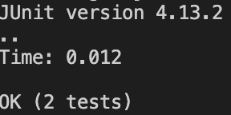

# Lab Report 5
## Sebastian Roemer

Here is the script I created to automatically grade a students repository.

<pre><code>
set -e

rm -rf student-submission
git clone $1 student-submission
cat TestListExamples.java >> student-submission/TestListExamples.java
cp -r lib student-submission
cd student-submission
FILE=ListExamples.java
if [ -f "$FILE" ]; then
    if javac -cp .:lib/hamcrest-core-1.3.jar:lib/junit-4.13.2.jar *.java; 
    then 
        if java -cp .:lib/hamcrest-core-1.3.jar:lib/junit-4.13.2.jar org.junit.runner.JUnitCore TestListExamples
        then 
        echo "Score: 2/2"
        else
        java -cp .:lib/hamcrest-core-1.3.jar:lib/junit-4.13.2.jar org.junit.runner.JUnitCore TestListExamples | tee -a output.txt
        echo "Number of tests passed out of 2"
        temp=$(grep -i "Tests run" output.txt)
        failedTests=$(echo $temp | cut -d ' ' -f 5)
        echo Score: $((2 - failedTests))/2

        fi
    else
        echo "Code did not compile. Score: 0"
    fi
else 
    echo "$FILE does not exist."
fi
</code></pre>

My code gives a score out of 2. Since there are 2 methods to check, for each method that passes, a point is given for a maximum of 2/2. 

# Testing a few repositories

## Repository #1: 

First I will be looking at the repository https://github.com/ucsd-cse15l-f22/list-methods-lab3

This should fail on one of the test cases, producing a score of 1/2.

This is what my script produces:

As you can see this produces a score of 1/2 as expected.

## Repository #2: 

Second I will be looking at the repository https://github.com/ucsd-cse15l-f22/list-methods-filename

This has the wrong file name, and therefore should produce a score of 0/2 with a helpful error message.

This is what my script produces:

As you can see this produces a score of 0/2 as expected, and says "ListExamples.java does not exist."

## Repository #3:

Third I will be looking at the repository https://github.com/ucsd-cse15l-f22/list-methods-corrected

This has a good implementation and therefore I except a score of 2/2.

This is what my script produces:

As you can see this produces a score of 2/2 as expected.

I will trace this one. 

# Trace of repository 3:

The first two commands have no return and an error code of 0.

Then, git clone produces the output with an error code of 0.

Then the next 4 commands have no output and an error code of 0.

Then an the if statement is run, which goes through since the statement inside is true (searching to see if the file exists.)

Then another if statement runs which also goes through since the statement inside is true (it compiles with an error code of 0). 

Then, another if statement runs which also goes through since the statement inside is true(the junit tests run with an error code of 0.) Inside the if statement produces the output of 

Then, there is the echo command which produces the output of 

Since the rest of the script is just else statements, and the if statements all went through, the script stops running and therefore none of the commands left in the script are run.

